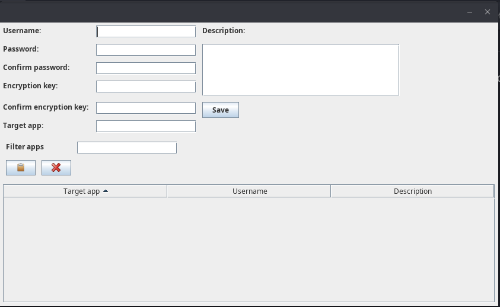

Benjalinpm Password Manager
=

This is the code for my benjalinpm application. It is a gui based password manager that I wrote with Java's Swing Framework. I started it as an exercise but ended up using it since 2016.

Feel free to copy the code and build it. I built it using:

```
mvn clean package
```

from inside the root directory of the project. That is, from inside benjalin-pm directory.

How it works
=

It makes use of derby, an embedded database. That means, all the data is stored on your machine inside .benjalinpm directory in your user home directory. Passwords are stored encrypted.

Here is what it looks like when ran:



You may add passwords to your database making use of the form in the application. The application asks you to insert your password twice to reduce the chance that a misstyped password is being stored. Similarly ,the application asks you to enter an encryption key for the password twice. Once you have saved a password you may retrieve it from the database of this application to use it.

To retrieve a password, click on the one you want to retrieve in the table that lists the passwords. After that, click the left button in the gui just below the filter fields. This will show a prompt where you are asked to provide your encryption key. If the key is correct, the password will be decrypted and stored to your clipboard for 15 seconds. After 15 seconds have passed, the clipboard content will be emptied by having "" written in it.

There is no master encryption key. I have a few encryption keys that I reuse and sometimes I may have to try multiple times to decrypt a password until I have tried the one I used to encrypt the password with.

I have used this password manager to store other forms of credentials, not only passwords.

I use the description field in the gui to add information that reminds me what I use a password for.

I use the filter field to filter passwords by the application the passwords belong to. For example, assuming I have multiple accounts at twitter, by typing twitter at the filter box I will have only those passwords that belong to my twitter accounts showing in the table.
